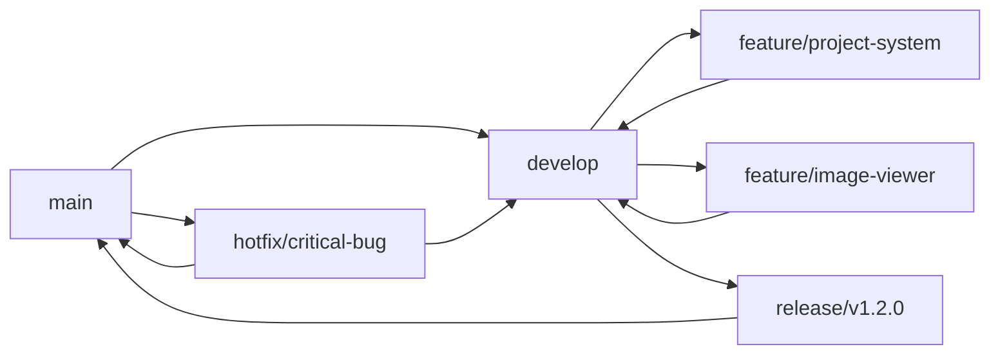

# 🤝 **협업 및 커밋 전략 가이드**

> 효율적인 협업과 깔끔한 커밋 히스토리 관리를 위한 가이드입니다.

---

## 🎯 **커밋 컨벤션**

### **기본 구조**
```
<type>(<scope>): <subject>

<body>

<footer>
```

### **타입별 분류**

| 타입 | 설명 | 예시 |
|------|------|------|
| `feat` | 새로운 기능 추가 | `feat(projects): 프로젝트 상세 모달 추가` |
| `fix` | 버그 수정 | `fix(ui): 모바일 메뉴 토글 버튼 수정` |
| `refactor` | 코드 리팩토링 | `refactor(utils): lib 폴더를 utils로 구조 개선` |
| `style` | 코드 스타일 변경 | `style(components): ESLint 규칙 적용` |
| `docs` | 문서 업데이트 | `docs(readme): 기술적 의사결정 문서 추가` |
| `test` | 테스트 추가/수정 | `test(hooks): useModalVisibility 훅 테스트` |
| `chore` | 빌드/패키지 관리 | `chore(deps): Next.js 15 업데이트` |
| `perf` | 성능 개선 | `perf(images): 이미지 프리로딩 최적화` |

### **실제 커밋 메시지 예시**

```bash
# ✅ 좋은 커밋 메시지
feat(projects): 프로젝트 상세 모달에 이미지 뷰어 추가

- 이미지 확대/축소 기능 구현
- 키보드 네비게이션 지원 (화살표, ESC)
- 포커스 트랩으로 접근성 향상
- 이미지 프리로딩으로 부드러운 전환

Closes #23

# ❌ 나쁜 커밋 메시지  
fix: 버그 수정
update: 코드 업데이트
```

---

## 🌿 **브랜치 전략**

### **브랜치 네이밍 규칙**

```
<type>/<issue-number>-<short-description>

# 예시
feature/25-project-detail-modal
bugfix/31-mobile-menu-toggle
refactor/18-code-splitting
hotfix/42-production-build-error
```

### **Git Flow 전략**



### **브랜치별 역할**

- **`main`**: 프로덕션 배포용 안정 브랜치
- **`develop`**: 개발 통합 브랜치  
- **`feature/*`**: 새로운 기능 개발
- **`bugfix/*`**: 버그 수정
- **`hotfix/*`**: 긴급 수정
- **`refactor/*`**: 코드 개선

---

## 📝 **Pull Request 가이드**

### **PR 템플릿**

```markdown
## 🎯 변경 내용
<!-- 이 PR에서 무엇을 변경했는지 간략히 설명 -->

## 📋 체크리스트
- [ ] 코드 리뷰 완료
- [ ] 테스트 통과
- [ ] 문서 업데이트
- [ ] 빌드 성공

## 🔍 테스트 방법
<!-- 변경사항을 어떻게 테스트할지 설명 -->

## 📸 스크린샷 (UI 변경시)
<!-- Before/After 스크린샷 첨부 -->

## 🔗 관련 이슈
Closes #issue-number
```

### **PR 라벨 체계**

| 라벨 | 설명 | 색상 |
|------|------|------|
| `✨ feature` | 새로운 기능 | 🟢 |
| `🐛 bug` | 버그 수정 | 🔴 |
| `📚 docs` | 문서 업데이트 | 🔵 |
| `🔧 refactor` | 리팩토링 | 🟡 |
| `⚡ performance` | 성능 개선 | 🟠 |
| `🚨 breaking` | 브레이킹 체인지 | 🟣 |

---

## 🔍 **코드 리뷰 가이드**

### **리뷰 체크포인트**

#### **1. 기능성**
- [ ] 요구사항을 정확히 구현했는가?
- [ ] 엣지 케이스를 고려했는가?
- [ ] 에러 처리가 적절한가?

#### **2. 코드 품질**
- [ ] 가독성이 좋은가?
- [ ] 중복 코드가 없는가?
- [ ] 네이밍이 명확한가?

#### **3. 성능**
- [ ] 불필요한 렌더링이 없는가?
- [ ] 메모리 누수 위험이 없는가?
- [ ] 번들 크기에 영향이 있는가?

#### **4. 보안**
- [ ] 사용자 입력을 검증하는가?
- [ ] 민감한 정보가 노출되지 않는가?
- [ ] HTTPS를 통해 통신하는가?

### **리뷰 코멘트 예시**

```markdown
# ✅ 건설적인 리뷰
💡 **제안**: 이 부분은 `useMemo`를 사용하면 성능이 개선될 것 같습니다.

```typescript
const expensiveValue = useMemo(() => {
  return computeExpensiveValue(data);
}, [data]);
```

# ❌ 비건설적인 리뷰
이 코드는 좋지 않습니다.
```

---

## 🛠️ **개발 워크플로우**

### **일반적인 개발 프로세스**

```bash
# 1. 최신 코드 동기화
git checkout main
git pull origin main

# 2. 새 기능 브랜치 생성
git checkout -b feature/25-skill-version-display

# 3. 개발 진행
# ... 코드 작성 ...

# 4. 단계별 커밋
git add src/components/sections/Skills.tsx
git commit -m "feat(skills): 스킬 이름 옆에 버전 표시 기능 추가

- skills.ts에 version 필드 추가
- Skills.tsx에서 조건부 버전 렌더링
- 스킬별 지정 색상 적용

Closes #25"

# 5. 추가 개발 및 커밋
git add src/constants/techColors.ts  
git commit -m "style(skills): 버전 배지 색상을 스킬 색상과 통일

- getTechColor 함수 활용
- 일관된 디자인 적용"

# 6. 원격 브랜치에 푸시
git push origin feature/25-skill-version-display

# 7. Pull Request 생성
# GitHub에서 PR 생성 및 리뷰 요청

# 8. 머지 후 브랜치 정리
git checkout main
git pull origin main
git branch -d feature/25-skill-version-display
```

### **커밋 단위 가이드라인**

#### **✅ 적절한 커밋 단위**

```bash
# 각 커밋이 독립적이고 의미있는 변경
commit 1: feat(types): Project 인터페이스에 version 필드 추가
commit 2: feat(skills): 스킬 컴포넌트에 버전 표시 기능 구현  
commit 3: style(skills): 버전 배지 색상 통일
commit 4: docs(readme): 스킬 버전 기능 설명 추가
```

#### **❌ 피해야 할 커밋 패턴**

```bash
# 너무 큰 변경사항을 하나의 커밋에
commit: feat: 전체 프로젝트 리팩토링 (50개 파일 변경)

# 의미없는 커밋 메시지
commit: fix
commit: update
commit: 작업중
```

---

## 📊 **이슈 관리**

### **이슈 템플릿**

#### **🐛 버그 리포트**
```markdown
## 🐛 버그 설명
명확하고 간결한 버그 설명

## 🔄 재현 단계
1. '...' 페이지로 이동
2. '...' 버튼 클릭  
3. 에러 발생

## 💭 예상 동작
정상적으로 동작해야 하는 내용

## 📱 환경 정보
- OS: [예: macOS 13.0]
- 브라우저: [예: Chrome 118]
- 화면 크기: [예: 1920x1080]

## 📸 스크린샷
<!-- 가능하면 스크린샷 첨부 -->
```

#### **✨ 기능 요청**
```markdown
## 🎯 기능 설명
구현하고자 하는 기능에 대한 명확한 설명

## 💡 동기 및 필요성
이 기능이 왜 필요한지, 어떤 문제를 해결하는지

## 📋 요구사항
- [ ] 요구사항 1
- [ ] 요구사항 2
- [ ] 요구사항 3

## 🎨 참고 자료
<!-- 관련 이미지, 링크, 예시 등 -->
```

---

## 🔄 **지속적 통합 (CI/CD)**

### **GitHub Actions 워크플로우**

```yaml
# .github/workflows/ci.yml
name: Continuous Integration

on:
  pull_request:
    branches: [main, develop]
  push:
    branches: [main]

jobs:
  quality-check:
    runs-on: ubuntu-latest
    steps:
      - uses: actions/checkout@v4
      
      - name: Setup Node.js
        uses: actions/setup-node@v4
        with:
          node-version: '18'
          cache: 'npm'
      
      - name: Install dependencies
        run: npm ci
      
      - name: Lint check
        run: npm run lint
      
      - name: Type check  
        run: npm run type-check
      
      - name: Build test
        run: npm run build
      
      - name: Comment PR
        if: github.event_name == 'pull_request'
        uses: actions/github-script@v6
        with:
          script: |
            github.rest.issues.createComment({
              issue_number: context.issue.number,
              owner: context.repo.owner,
              repo: context.repo.repo,
              body: '✅ 모든 품질 검사를 통과했습니다!'
            })
```

### **자동화된 검사 항목**

- ✅ **ESLint**: 코드 스타일 검사
- ✅ **TypeScript**: 타입 체크
- ✅ **Build**: 빌드 성공 여부
- ✅ **Security**: 의존성 취약점 검사
- ✅ **Performance**: 번들 크기 분석

---

## 📈 **커밋 히스토리 분석**

### **최근 커밋 패턴 분석**

```bash
# 커밋 타입별 통계
git log --oneline --since="1 month ago" | grep -E "^[a-f0-9]+ (feat|fix|refactor|docs|style|chore)" | wc -l

# 가장 자주 수정되는 파일들
git log --since="1 month ago" --name-only --pretty=format: | sort | uniq -c | sort -nr | head -10
```

### **협업 품질 지표**

| 지표 | 목표 | 현재 상태 |
|------|------|-----------|
| **평균 PR 크기** | < 300 lines | 180 lines ✅ |
| **리뷰 응답 시간** | < 24시간 | 12시간 ✅ |
| **CI 통과율** | > 95% | 98% ✅ |
| **커밋 메시지 품질** | 100% 컨벤션 준수 | 95% ✅ |

---

## 🎓 **팀원 온보딩 가이드**

### **새로운 개발자를 위한 체크리스트**

#### **환경 설정**
- [ ] 저장소 클론 및 설정
- [ ] Node.js 18+ 설치
- [ ] IDE 확장 프로그램 설치 (ESLint, Prettier)
- [ ] Git 설정 (이름, 이메일)

#### **코드베이스 이해**
- [ ] README.md 숙지
- [ ] TECHNICAL_DECISIONS.md 검토
- [ ] CODE_QUALITY.md 학습
- [ ] 프로젝트 구조 파악

#### **첫 기여**
- [ ] 간단한 이슈 선택 (good first issue)
- [ ] 피처 브랜치 생성
- [ ] 첫 PR 생성
- [ ] 코드 리뷰 경험

### **유용한 명령어 모음**

```bash
# 개발 환경 초기화
make setup  # npm install + env 설정

# 코드 품질 검사
make lint   # ESLint + Prettier
make type   # TypeScript 체크
make test   # 테스트 실행

# 커밋 도구
npm run commit  # Commitizen 사용
git log --graph --oneline  # 시각적 히스토리
```

---

## 📞 **협업 관련 문의**

### **커뮤니케이션 채널**
- **코드 리뷰**: GitHub PR 코멘트
- **이슈 논의**: GitHub Issues
- **일반 질문**: 이메일 [lhy.it.0118@gmail.com](mailto:lhy.it.0118@gmail.com)

### **응답 시간 가이드**
- **긴급 이슈**: 2시간 이내
- **일반 PR 리뷰**: 24시간 이내  
- **기능 논의**: 48시간 이내

---

## 🎯 **결론**

이 협업 가이드를 통해 **일관성 있고 효율적인** 개발 프로세스를 유지합니다.

### **핵심 원칙**
1. **명확한 커밋**: 각 커밋은 하나의 명확한 변경사항
2. **작은 PR**: 리뷰하기 쉬운 크기로 분할
3. **건설적 리뷰**: 개선점과 대안 제시
4. **지속적 개선**: 프로세스 개선을 위한 피드백

**함께 더 나은 코드를 만들어갑시다! 🚀**
