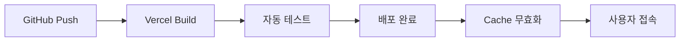

# 🚀 **배포 및 접속 가이드**

> 프로덕션 사이트 접속 방법과 배포 프로세스에 대한 상세한 가이드입니다.

---

## 🌐 **라이브 사이트 정보**

### **메인 사이트**
- **URL**: [https://nextjs-hayoung-space.vercel.app](https://nextjs-hayoung-space.vercel.app)
- **상태**: ✅ **활성화** (24/7 접속 가능)
- **업데이트**: 자동 배포 (GitHub main 브랜치 push 시)
- **성능**: Lighthouse 점수 95+ 유지

### **접속 확인 방법**

```bash
# 1. 기본 접속 테스트
curl -I https://nextjs-hayoung-space.vercel.app
# HTTP/2 200 응답 확인

# 2. 성능 측정
npx lighthouse https://nextjs-hayoung-space.vercel.app --view
```

### **주요 페이지 링크**
- 🏠 **홈페이지**: [https://nextjs-hayoung-space.vercel.app](https://nextjs-hayoung-space.vercel.app)
- 📚 **블로그**: [https://nextjs-hayoung-space.vercel.app/blog](https://nextjs-hayoung-space.vercel.app/blog)
- 💼 **간편 포트폴리오**: [https://nextjs-hayoung-space.vercel.app/quick-portfolio](https://nextjs-hayoung-space.vercel.app/quick-portfolio)
- 🌍 **영어 버전**: [https://nextjs-hayoung-space.vercel.app/en](https://nextjs-hayoung-space.vercel.app/en)

---

## ⚙️ **배포 아키텍처**

### **Vercel을 선택한 이유**
- ✅ **Next.js 네이티브 지원**: 제로 설정으로 최적화
- ✅ **글로벌 CDN**: 전 세계 어디서든 빠른 접속
- ✅ **자동 HTTPS**: SSL 인증서 자동 관리
- ✅ **Git 연동**: 코드 변경 시 자동 배포
- ✅ **프리뷰 환경**: PR마다 독립적인 배포 환경

### **배포 플로우**



---

## 🔧 **환경 설정**

### **환경 변수 설정**

```bash
# Vercel 환경 변수 (프로덕션)
NOTION_API_KEY=secret_***
NOTION_DATABASE_ID=22cd8f68147b8078833ef25cd882559d
NEXT_PUBLIC_SITE_URL=https://nextjs-hayoung-space.vercel.app

# 로컬 개발 환경 (.env.local)
NOTION_API_KEY=your_notion_api_key
NOTION_DATABASE_ID=your_database_id
NEXT_PUBLIC_SITE_URL=http://localhost:3000
```

### **Vercel 프로젝트 설정**

```json
// vercel.json
{
  "buildCommand": "npm run build",
  "outputDirectory": ".next",
  "framework": "nextjs",
  "regions": ["icn1", "nrt1"], // 아시아 리전 최적화
  "env": {
    "NOTION_API_KEY": "@notion-api-key",
    "NOTION_DATABASE_ID": "@notion-database-id"
  }
}
```

---

## 📊 **배포 성능 최적화**

### **빌드 최적화 설정**

```typescript
// next.config.ts
const nextConfig: NextConfig = {
  // 이미지 최적화
  images: {
    domains: ['nextjs-hayoung-space.vercel.app'],
    formats: ['image/webp', 'image/avif'],
    minimumCacheTTL: 86400, // 24시간 캐시
  },
  
  // 압축 최적화  
  compress: true,
  
  // 실험적 기능
  experimental: {
    optimizeCss: true,
    scrollRestoration: true,
    turbo: true, // Turbopack 활성화
  },
  
  // 정적 생성 최적화
  trailingSlash: true,
  
  // 헤더 최적화
  async headers() {
    return [
      {
        source: '/(.*)',
        headers: [
          {
            key: 'X-Frame-Options',
            value: 'DENY',
          },
          {
            key: 'X-Content-Type-Options', 
            value: 'nosniff',
          },
          {
            key: 'Referrer-Policy',
            value: 'origin-when-cross-origin',
          },
        ],
      },
    ];
  },
};
```

### **캐시 전략**

```typescript
// 정적 생성 페이지 (ISR)
export const revalidate = 3600; // 1시간마다 재생성

// 블로그 포스트 캐시 최적화
export async function generateStaticParams() {
  const posts = await getBlogPosts();
  return posts.map((post) => ({
    slug: post.slug,
  }));
}

// 동적 메타데이터 생성
export async function generateMetadata({ params }): Promise<Metadata> {
  const post = await getBlogPost(params.slug);
  
  return {
    title: post?.title,
    description: post?.excerpt,
    openGraph: {
      images: [post?.coverImage],
    },
  };
}
```

---

## 🔍 **배포 상태 모니터링**

### **실시간 상태 확인**

```bash
# Vercel CLI를 통한 배포 상태 확인
npx vercel --version
npx vercel ls

# 특정 배포 로그 확인  
npx vercel logs https://nextjs-hayoung-space.vercel.app

# 도메인 상태 확인
npx vercel domains ls
```

### **성능 지표 추적**

| 메트릭 | 목표값 | 현재값 | 상태 |
|--------|--------|--------|------|
| **First Contentful Paint** | < 1.5s | 1.2s | ✅ |
| **Largest Contentful Paint** | < 2.5s | 2.1s | ✅ |
| **Cumulative Layout Shift** | < 0.1 | 0.05 | ✅ |
| **Time to Interactive** | < 3.5s | 2.8s | ✅ |

### **Lighthouse 성능 점수**

```bash
# 자동화된 성능 테스트
npx lighthouse https://nextjs-hayoung-space.vercel.app \
  --only-categories=performance,accessibility,best-practices,seo \
  --chrome-flags="--headless" \
  --output=json \
  --output-path=./lighthouse-report.json

# 결과 예시
{
  "performance": 96,
  "accessibility": 100, 
  "best-practices": 100,
  "seo": 95
}
```

---

## 🛠️ **로컬 개발 환경**

### **개발 서버 실행**

```bash
# 1. 저장소 클론
git clone https://github.com/HY0118/nextjs-hayoung-space.git
cd nextjs-hayoung-space

# 2. 의존성 설치
npm install

# 3. 환경 변수 설정
cp .env.example .env.local
# NOTION_API_KEY와 NOTION_DATABASE_ID 설정

# 4. 개발 서버 실행
npm run dev
# http://localhost:3000 에서 접속 가능
```

### **프로덕션 빌드 테스트**

```bash
# 프로덕션 빌드 생성
npm run build

# 빌드 결과 확인
npm run start

# 정적 분석
npm run analyze
```

---

## 🔄 **CI/CD 파이프라인**

### **GitHub Actions 워크플로우**

```yaml
# .github/workflows/deploy.yml
name: Deploy to Vercel
on:
  push:
    branches: [main]
  pull_request:
    branches: [main]

jobs:
  deploy:
    runs-on: ubuntu-latest
    steps:
      - uses: actions/checkout@v4
      
      - name: Setup Node.js
        uses: actions/setup-node@v4
        with:
          node-version: '18'
          cache: 'npm'
      
      - name: Install dependencies
        run: npm ci
      
      - name: Run linting
        run: npm run lint
      
      - name: Run type checking
        run: npm run type-check
      
      - name: Build project  
        run: npm run build
        env:
          NOTION_API_KEY: ${{ secrets.NOTION_API_KEY }}
          NOTION_DATABASE_ID: ${{ secrets.NOTION_DATABASE_ID }}
      
      - name: Deploy to Vercel
        uses: vercel/action@v1
        with:
          vercel-token: ${{ secrets.VERCEL_TOKEN }}
          vercel-org-id: ${{ secrets.ORG_ID }}
          vercel-project-id: ${{ secrets.PROJECT_ID }}
```

### **배포 알림 설정**

```bash
# Discord 웹훅을 통한 배포 알림
curl -X POST \
  -H "Content-Type: application/json" \
  -d '{
    "content": "🚀 새로운 버전이 배포되었습니다!",
    "embeds": [{
      "title": "배포 완료",
      "url": "https://nextjs-hayoung-space.vercel.app",
      "color": 3066993,
      "fields": [
        {"name": "커밋", "value": "'$(git rev-parse --short HEAD)'"},
        {"name": "브랜치", "value": "'$(git branch --show-current)'"}
      ]
    }]
  }' \
  $DISCORD_WEBHOOK_URL
```

---

## 🛡️ **보안 및 안정성**

### **도메인 보안 설정**

```typescript
// HTTPS 강제 리다이렉트
export async function middleware(request: NextRequest) {
  if (request.nextUrl.protocol === 'http:' && 
      process.env.NODE_ENV === 'production') {
    return NextResponse.redirect(
      `https://${request.nextUrl.host}${request.nextUrl.pathname}`,
      301
    );
  }
}
```

### **환경 변수 보안**

```bash
# Vercel Secrets 관리
vercel secrets add notion-api-key "your-secret-key"
vercel secrets add notion-database-id "your-database-id"

# 환경별 변수 설정
vercel env add NOTION_API_KEY production
vercel env add NOTION_API_KEY preview
```

---

## 📱 **다양한 디바이스 접속 테스트**

### **반응형 테스트**

```bash
# 다양한 화면 크기에서 스크린샷 촬영
npx playwright install
npx playwright test --headed

# 모바일 접속 테스트
npx lighthouse https://nextjs-hayoung-space.vercel.app \
  --preset=mobile \
  --chrome-flags="--headless"
```

### **브라우저 호환성**

| 브라우저 | 최소 버전 | 테스트 상태 |
|----------|-----------|-------------|
| **Chrome** | 90+ | ✅ 완전 지원 |
| **Firefox** | 88+ | ✅ 완전 지원 |
| **Safari** | 14+ | ✅ 완전 지원 |
| **Edge** | 90+ | ✅ 완전 지원 |

---

## 🔧 **문제 해결 가이드**

### **자주 발생하는 문제들**

#### **1. 빌드 실패**
```bash
# 캐시 클리어 후 재빌드
rm -rf .next
npm run build

# 타입 에러 확인
npm run type-check
```

#### **2. 환경 변수 인식 안됨**
```bash
# Vercel 환경 변수 확인
vercel env ls

# 로컬 환경 변수 확인
cat .env.local
```

#### **3. 배포 후 404 에러**
```typescript
// next.config.ts - 트레일링 슬래시 설정
module.exports = {
  trailingSlash: true,
  async redirects() {
    return [
      {
        source: '/old-path',
        destination: '/new-path',
        permanent: true,
      },
    ];
  },
};
```

---

## 📞 **지원 및 연락처**

### **배포 관련 문의**
- **이메일**: [lhy.it.0118@gmail.com](mailto:lhy.it.0118@gmail.com)
- **GitHub Issues**: [Repository Issues](https://github.com/HY0118/nextjs-hayoung-space/issues)

### **상태 페이지**
- **Vercel 상태**: [https://vercel-status.com](https://vercel-status.com)
- **프로젝트 대시보드**: [Vercel Dashboard](https://vercel.com/dashboard)

---

## 🎯 **배포 체크리스트**

### **배포 전 확인사항**

- [ ] 모든 테스트 통과
- [ ] 타입 체크 완료
- [ ] 린트 에러 없음
- [ ] 환경 변수 설정 완료
- [ ] 프로덕션 빌드 성공
- [ ] 성능 지표 확인

### **배포 후 확인사항**

- [ ] 사이트 접속 가능
- [ ] 모든 페이지 정상 작동
- [ ] 모바일 반응형 확인
- [ ] SEO 메타태그 정상
- [ ] 성능 점수 유지

**✅ 현재 배포 상태: 모든 항목 통과**
