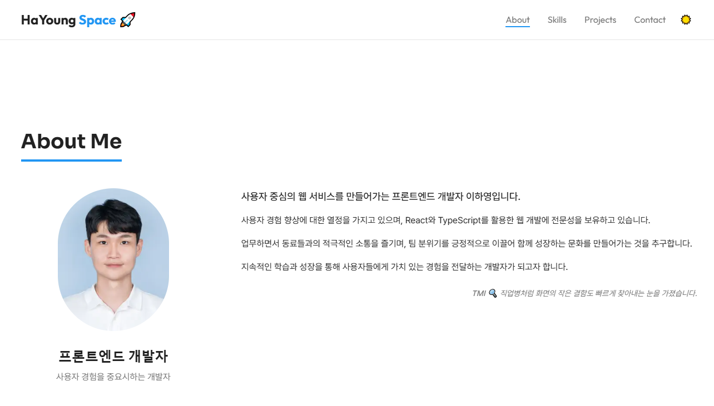

# 🌐 HaYoung's Space

안녕하세요! 이 레포지토리는 저의 블로그 겸 포트폴리오용 GitHub 페이지입니다.

## 프로젝트 소개

이 프로젝트는 **개인 블로그**와 **포트폴리오**를 함께 운영하기 위한 레포지토리입니다.
Markdown 및 Next.js/Vercel 등 정적 사이트 생성기를 이용해 손쉽게 웹사이트를 구성했습니다.

- **주요 내용**
  - 프로젝트, 기술 스택, 경력 등을 한눈에 볼 수 있습니다.
  -

## 포트폴리오 링크

- **포트폴리오 페이지**:
  [https://nextjs-hayoung-space.vercel.app](https://nextjs-hayoung-space.vercel.app)

## 🛠 Tech Stack

| 구분                  | 사용 기술 및 도구                                                                                                                                                                                                                                                                                                                                                                                                                                                                                                                                                                                                                                                                                                                                                                                                                                                                                                                                                                                                                                                                    |
| --------------------- | ------------------------------------------------------------------------------------------------------------------------------------------------------------------------------------------------------------------------------------------------------------------------------------------------------------------------------------------------------------------------------------------------------------------------------------------------------------------------------------------------------------------------------------------------------------------------------------------------------------------------------------------------------------------------------------------------------------------------------------------------------------------------------------------------------------------------------------------------------------------------------------------------------------------------------------------------------------------------------------------------------------------------------------------------------------------------------------ |
| **Front-End**         |                      Recoil, CSS-in-JS, Jest, JSON Schema, TanStack Query(React Query), rjsf |
| **Back-End**          |       MariaDB, Oracle DB, RESTful API, JWT 인증, DCMTK (DICOM)                                                                                                                                                                                                                                                                                                                                                                                                                                                                                                                                                                                                                                                                                                                                                                             |
| **DevOps / 아키텍처** |                OpenSearch (Elasticsearch)                                                                                                                                                                                                                                                                                                                                     |
| **CI/CD 및 배포**     |    InstallShield,                SVN, Fork                                                                                                                                                                                                                          |
| **디자인 및 협업**    |          TSDoc                                                                                                                                                                                                                                                                                                                                                                                                                                                                                                                                                                                                                                           |

## 작업물 미리보기

| 페이지       | 스크린샷                                                                            |
| ------------ | ----------------------------------------------------------------------------------- |
| **홈(Home)** |  |

## Contact

- **Email**: [lhy.it.0118@gmail.com](lhy.it.0118@gmail.com)
- **LinkedIn**:
  [linkedin.com/in/hayoung-lee-756b72332](https://linkedin.com/in/hayoung-lee-756b72332)
- **GitHub**: [github.com/HY0118](https://github.com/HY0118)
